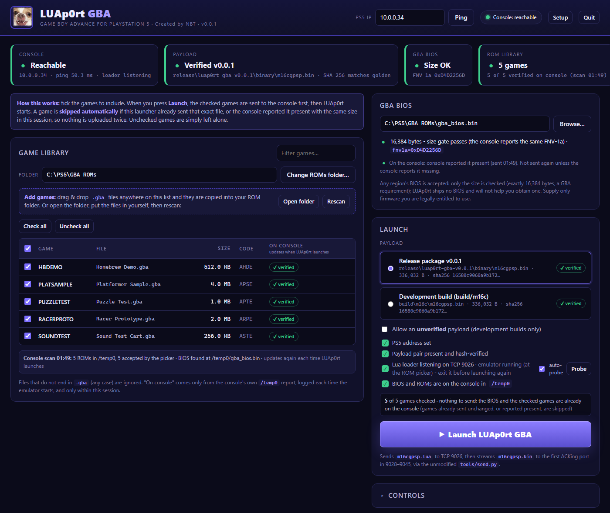

# LUAp0rt GBA

### GAME BOY ADVANCE FOR PLAYSTATION 5

**Created by NBT**

**Version: v0.1.0** (payload v0.0.1, unchanged) · **Desktop launcher 1.0**



---

## Disclaimer — read this first

LUAp0rt GBA is an independent, non-commercial homebrew project provided **for
educational and research purposes only**. It is not affiliated with, endorsed
by, or supported by Sony Interactive Entertainment or Nintendo. It is provided
**"as is", without warranty of any kind** (see [`LICENSE`](LICENSE), sections
11 and 12).

**You use it entirely at your own risk. The author is not responsible for any
damage to your console, computer, data, accounts or other property, or for any
other loss arising from its use, misuse, or inability to use it.** Running
homebrew may void warranties or breach terms of service. You are responsible
for complying with the laws of your jurisdiction and for supplying only games
and firmware you are legally entitled to use. No ROMs, no BIOS and no user
data are included or linked, and none will be.

---

## What this is

**LUAp0rt GBA** is a Game Boy Advance emulator integration for the PlayStation 5.

It is built around **LUAp0rt** — a reusable runtime and platform architecture
created by NBT for running native code payloads on the PS5 — combined with the
**gpSP** Game Boy Advance emulator core. LUAp0rt provides the platform layer
(memory, video, audio, input, file access and session lifecycle); gpSP provides
the GBA emulation. LUAp0rt GBA is the integration of the two, plus a ROM picker
and save system built for the console.

**v0.1.0 adds a Windows desktop launcher.** It sends your games and BIOS to the
console and starts the emulator with one button, no Python or command line
needed. The emulator payload itself is the hardware-validated v0.0.1 binary,
byte for byte.

> **A note on expectations.** This is an early release. The features below were
> tested on hardware with specific games, but **no claim is made that any
> particular game works, or that the GBA library is broadly compatible.** Some
> games will not run correctly.

---

## Quick Start (Windows, with the launcher)

### 1. You need to supply two things yourself

LUAp0rt GBA ships **no games and no console firmware**.

| What | Rule |
| --- | --- |
| **GBA ROMs** | files ending in **`.gba`** (any case), in a folder on your PC |
| **GBA BIOS** | a `gba_bios.bin` of **exactly 16,384 bytes** (any region; only the size is checked, a GBA requirement) |

You are responsible for supplying only games and firmware you are legally
entitled to use.

### 2. Start the launcher

Extract the package, then double-click **`launcher\LUAp0rt-Launcher.exe`**.

Windows SmartScreen may warn that the program is unsigned: choose *More info →
Run anyway*. The launcher starts a small local server (it listens on your PC
only, never on the network) and opens the dashboard in your default browser. A
tray icon and a small status window show that it is running; the console log
and tool output live at the bottom of the dashboard.

### 3. Follow the guided setup

The first time, a six-step guide opens:

1. **Console address** — enter the PS5's IP and press *Test*.
2. **GBA BIOS** — point it at your `gba_bios.bin`; it is verified on the spot.
3. **ROM folder** — pick the folder that holds your `.gba` files.
4. **Arm the loader** — start your Luac0re Lua loader on the console so it is
   listening on port 9026, then press *Check the loader*. The guide tells you
   whether it answered.
5. **Games to include** — include every game, or pick them yourself in the
   library.
6. **Ready** — press **Launch**.

Everything is remembered, so later starts go straight to the dashboard. *Setup*
in the top bar reruns the guide.

### 4. Press Launch

The library is a checklist. When you press **Launch**, the BIOS and the checked
games are sent to the console first (a progress window shows each file), then
the emulator starts and its own log scrolls in below. **Games already on the
console are skipped automatically**: a game is sent only if this launcher has
not already sent that exact file, or the console has not reported it present
with the same size. Once the emulator boots, each game shows **verified** from
the console's own listing of `/temp0`.

To add games later, drag and drop `.gba` files onto the library, or open the
folder, copy them in, and press *Rescan*.

### Things the launcher tells you

- **While the emulator is running, the loader is not listening.** To launch
  again or send more games: hold **L1 + R1 + L2 + R2** to return to the ROM
  picker, press **CIRCLE** to exit, re-arm the loader, then press Launch.
- If anything is red when you press Launch, a dialog explains it and offers a
  *Fix this* button for each item.
- The payload's SHA-256 is checked against the frozen release value before every
  launch. An unverified binary is refused unless you explicitly allow it.

Full details, including how to run the launcher from source on any platform:
[`launcher/README.md`](launcher/README.md).

---

## Launching without the launcher

The launcher only runs the tools that ship in this package. From the package
root, the payload can be sent by hand:

```sh
python source-snapshot/tools/send.py <PS5_IP> binary/m16cgpsp.lua binary/m16cgpsp.bin
```

Both files are required; the binary cannot be sent alone. Your PS5 Lua/JIT
environment must already be running with its remote Lua loader listening. This
package does not create that environment and does not describe how to obtain
or set one up.

Files can be sent by hand with the launcher's copy of the uploader:

```sh
python launcher/tools/upload.py <PS5_IP> <local file> /temp0/<name>
```

The console reads ROMs from `/temp0` (up to **64**, `.gba` only) and the BIOS
from `/temp0/gba_bios.bin` (fallback `/savedata0/bios/gba_bios.bin`). More
detail: [`docs/deploy-ps5.md`](docs/deploy-ps5.md).

---

## Controls

| Physical input | GBA key |
| --- | --- |
| **( X )** / **( O )** | **A** |
| **Square** / **Triangle** | **B** |
| **D-pad** | **D-pad** |
| **L1** | **L** |
| **R1** | **R** |
| **OPTIONS** | **START** |
| **TOUCHPAD** | **SELECT** |

Two buttons are offered for each of A and B so you can hold the controller
however feels natural.

### Return to the ROM picker

**Hold `L1` + `R1` + `L2` + `R2`** — all four shoulder buttons together. This
ends the current game and returns you to the ROM picker. **CIRCLE** at the
picker exits the emulator. `L2` and `R2` are intentionally not mapped to any
GBA key, so this chord can never collide with gameplay input. Full detail:
[`docs/controls.md`](docs/controls.md).

---

## Saves

**LUAp0rt GBA supports persistent in-game saves.** Your progress is written to
the console and survives returning to the picker and relaunching.

These save types were validated on real hardware: **SRAM, FLASH64, FLASH128,
EEPROM512, EEPROM8K**. That covers the save hardware used by the great majority
of GBA cartridges.

> **This is not a promise that every game saves correctly.** It means each of
> those five save classes was exercised on hardware and passed. Individual games
> can still fail for reasons unrelated to save class.

---

## Features

Validated on PlayStation 5 hardware in v0.0.1:

- **ROM picker** — browse and launch from up to 64 ROMs in `/temp0`
- **GBA gameplay** — emulation via the gpSP core
- **DualSense controls** — full mapping, described above
- **Audio**
- **Framebuffer presentation** — video output to the console display
- **Large-ROM demand paging** — cartridges larger than the resident buffer
  stream in on demand rather than needing to fit in memory at once
- **Persistent saves** — the five save classes listed above
- **Return-to-picker session lifecycle** — end a game and pick another without
  relaunching the payload

New in v0.1.0, on the PC side:

- **Desktop launcher** — guided setup, checklist library, one-button send and
  launch, drag-and-drop ROM import, live console log, loader and console
  checks, tray icon and status window

### Not in this release

**Netplay is not included.** No networked or multiplayer functionality ships in
this version. Other known limitations are documented in
[`docs/limitations.md`](docs/limitations.md).

---

## Legal and content policy

- **LUAp0rt does not include commercial ROMs.**
- **LUAp0rt does not include Nintendo's proprietary GBA BIOS.**
- **LUAp0rt does not include user save data.**
- **No download links for ROMs or proprietary BIOS files are provided here, and
  none will be.**

**Users are responsible for supplying any games or firmware they are legally
entitled to use.**

---

## License and credits

**LUAp0rt — Created by NBT**

```
LUAp0rt
Copyright (C) 2026 NBT

Original LUAp0rt code is licensed under the GNU General Public
License version 2 or, at your option, any later version.
```

**SPDX-License-Identifier: `GPL-2.0-or-later`**

This covers **NBT's original LUAp0rt work only**, including the desktop launcher.

### Third-party software

This project incorporates and derives from software created by other people.
**Those components remain the copyright of their respective authors and are
distributed under their own licenses.** NBT is not the author of gpSP, LuaPSX,
EmuC0re, libretro-common, Luac0re, mGBA, or any other upstream project — and
none of those projects or their developers is the creator of LUAp0rt.

The launcher executable bundles Python 3.11, Tcl/Tk, Pillow and pystray, and
is packaged with PyInstaller; those run on the PC only and their license texts
are in [`licenses/`](licenses/).

| Document | What it covers |
| --- | --- |
| [`LICENSE`](LICENSE) | Canonical GNU GPL v2 text |
| [`COPYRIGHT`](COPYRIGHT) | LUAp0rt's own copyright and license notice |
| [`CREDITS.md`](CREDITS.md) | Who made what — LUAp0rt and every upstream project |
| [`THIRD_PARTY_NOTICES.md`](THIRD_PARTY_NOTICES.md) | Full provenance and incorporation record |
| [`licenses/`](licenses/) | Verbatim upstream license texts |

---

## What is in this package

| Path | Contents |
| --- | --- |
| `launcher/` | The desktop launcher: `LUAp0rt-Launcher.exe`, its source, and the send/upload tools it uses |
| `binary/` | The shipping payload, loader, ELF and link map (unchanged since v0.0.1) |
| `source-snapshot/` | Complete corresponding source for the shipping binary |
| `docs/` | Controls, deployment, build reproduction, limitations, the dashboard screenshot |
| `evidence/` | Hardware validation records, host gate results, manifests |
| `licenses/` | Upstream license texts |
| `SHA256SUMS` | SHA-256 of every file in this package |

To check that your copy is intact:

```sh
sha256sum -c SHA256SUMS
```

Build instructions: [`docs/build-reproduction.md`](docs/build-reproduction.md).
Full release record: [`RELEASE.md`](RELEASE.md).
